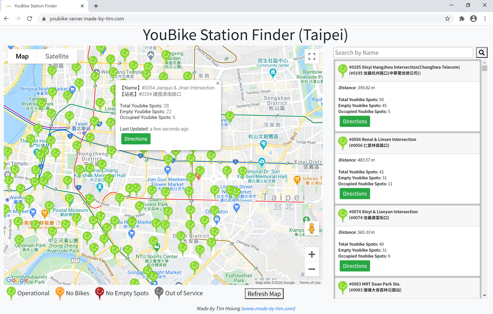

# Taipei City YouBike API 
**DEMO:** http://youbike-server.made-by-tim.com

This project displays YouBike Stations on a Google Map by querying a backend containing YouBike data for Taipei. It contains 2 projects: 1 server project, which contains both a single HTML/CSS/JS UI using a Google Map as well as  backend NodeJS/Express api server serving up various APIs to access the YouBike data of Taipei, Taiwan, and 1 worker project, which pulls data from a link and puts it into the DB periodically.

## Motivation
This project was to help me learn how to create an API backend using NodeJS/Express and MongoDB and adding tests. The Google Maps UI was to create a client that consumed these APIs and display them in an easy-to-understand way. The data comes from Taiwan's Open Data API. Also wanted to add a worker and deploy it to a cloud provider (Google) to make it more realistic and complete.

## Tech/Framework Used
* HTML/CSS/JS (Bootstrap, Handlebars)
* Node.js
* Express.js
* MongoDB

## Infrastructure Used
* Travis CI
* Docker

(Currently deployed using docker images on Google Cloud Run)

## Usage

This API (Postman can be used to test it out) has the following endpoints:

|Endpoint|Method|Params|Response|
|:---|:---|:---|:---|
|/api/stations|GET|none|returns all youbike stations in Taipei|
|/api/stations/list|GET|page, size|returns a paginated (page # **page** with **size** results)|
|/api/stations/search|GET|q, loc|searches for stations with text of "**q**" (english or chinese) and are close by **loc** |
|/api/stations/nearby|GET|loc|returns a list of highest ranked youbike stations closest to **loc**|

## (Possible) Features
- Better data update/reliability
- API Stats/Info collection through express middleware 

- API Authorization (developer portal/API to apply for developer token/secret; attach it to header)

- Add to CD pipeline