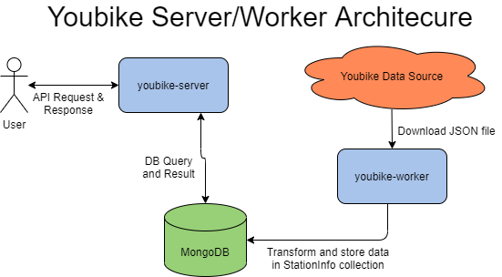

# Taipei City Youbike API 
**DEMO:** http://youbike-server.made-by-tim.com

This project allows users to query Youbike data for Taipei. It contains 2 projects: 1 worker project, which pulls data from a link and puts it into the DB periodically; and 1 server project, which is backend NodeJS/Express server serving up various APIs to access the Youbike data of Taipei, Taiwan.

## Motivation
This project was to help me learn how to create an API backend using NodeJS/Express and MongoDB and adding tests. The data comes from Taiwan's Open Data API. Also wanted to add a worker and deploy it 
to a cloud provider to make it more realistic and complete.

## Tech/Framework Used
* Node.js
* Express.js
* MongoDB

## Infrastructure Used
* Travis CI
* Docker

(Currently deployed using docker images on Google Cloud Run)

## Usage

This API server is meant to be used by a FE application (Postman can be used to test it out) and has the following endpoints:

|Endpoint|Method|Params|Response|
|:---|:---|:---|:---|
|/stations|GET|none|returns all youbike stations in Taipei|
|/stations/list|GET|page, size|returns a paginated (page # **page** with **size** results)|
|/stations/search|GET|q, loc|searches for stations with text of "**q**" (english or chinese) and are close by **loc** |
|/stations/nearby|GET|loc|returns a list of highest ranked youbike stations closest to **loc**|

## (Possible) Features
- Better data update/reliability
- API Stats/Info collection through express middleware 

- API Authorization (developer portal/API to apply for developer token/secret; attach it to header)
- Web UI Front-End (simple FE app with google map)

- Add to CD pipeline